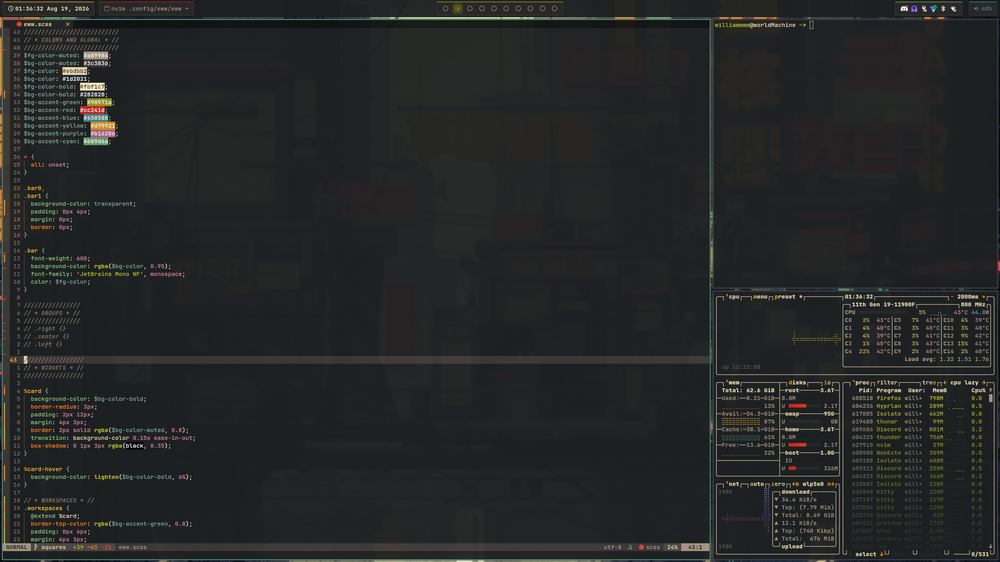
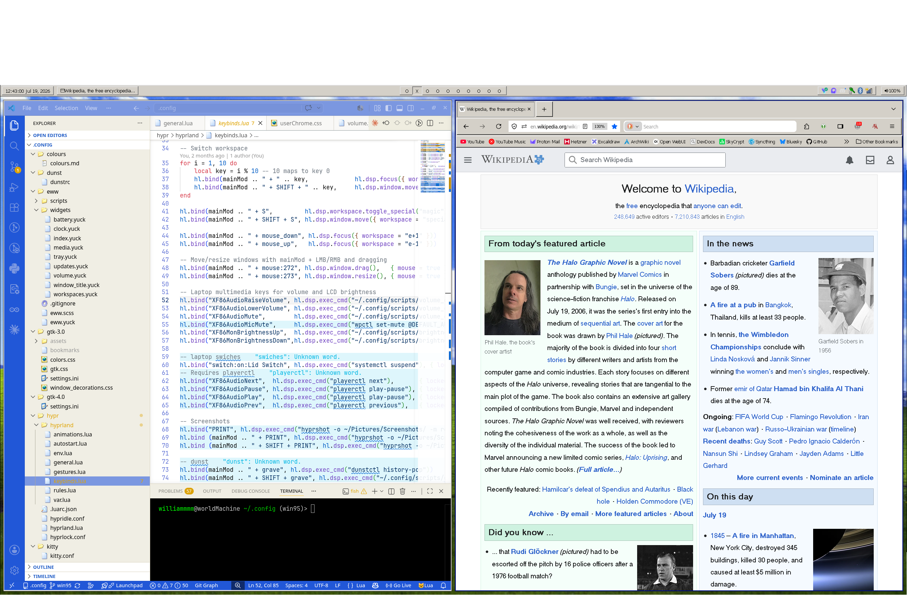
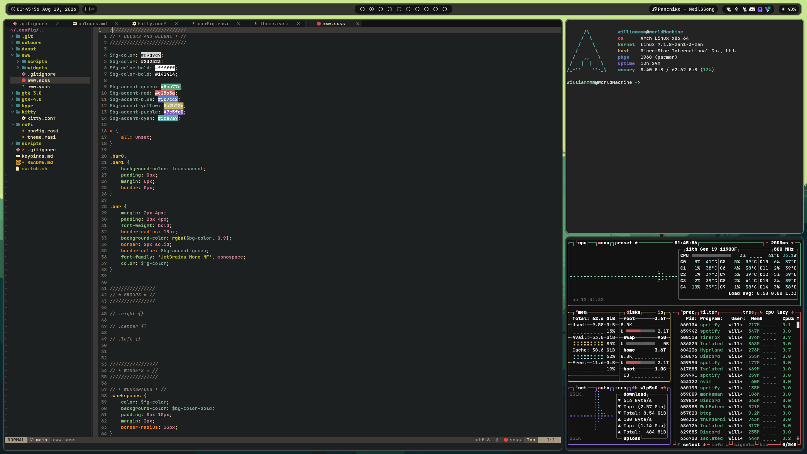

# Dotfiles

## Squares

## win95

## Rounded

## Usage
All setups feature a `switch.sh` script that sets gtk themes, icons, etc.

In the docs folder there is a list of [keybinds](docs/keybinds.md) and [dependencies](docs/SOFTWARE.md).
